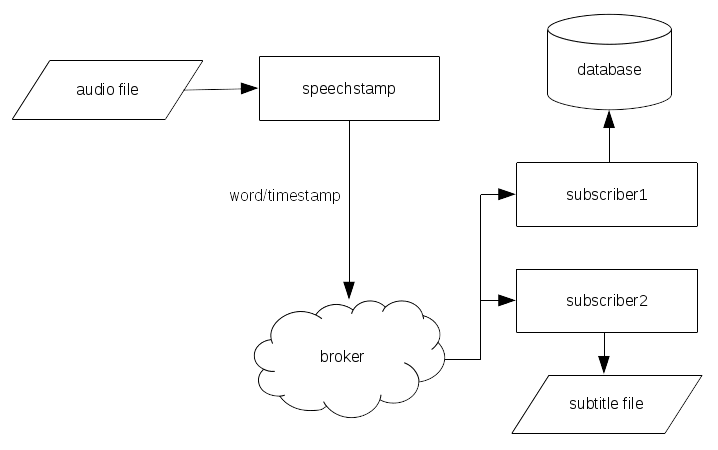

# speechstamp
Speech recognition on top of OpenVINO

## Goals
This showcase project aims at, given an audio file, extract words (speech
recognition) and timestamp each word, sending them to a broker that will then
serve the data to subscribers, using [OpenVINO](https://software.intel.com/en-us/openvino-toolkit)
and [MQTT](https://mqtt.org/).

As there are several steps in this pipeline, I am splitting the project on a
few goals:

- minimum viable product (MVP, a.k.a. POC):
    This is meant to be the minimum that should be able to deliver on the
    current course timeframe, and will serve as a proof-of-concept.

    The idea is to use OpenVINO with a pre-trained model, read a **wav** file
    and output the detected words on it.
- timestamp:
    Make a relation of the current word within a timestamp indicating when in
    the audio context that word appears.
- MQTT:
    Send (publish) word/timestamp to a broker that will made available this
    data to its subscribers.

Extra goals to make the project complete:

- Read audio file from another format than wav (*ulaw*, *mp3*?)
- Implement a subscriber that will persist the collected data (database)
- Implement a subscriber that will transform the word/timestamp tuple in a
  subtitle format

### Diagram
This is a flowchart showing the goal of this project. The *word/timestamp* transition is a stream of data, happening each time a word is recognized.


## What is done
This is project showcase is far from complete. There is a lot to study, comprehend and develop. However, there were [progress on getting things done](#project-progress), with some highlights below:
- Learning how speech recognition is done on OpenVINO
- Looking for examples and similar projects (fun fact: the very first name of this project was SpeechVINO, but later found that there were already a [project with this name](https://github.com/Speech-VINO) :p)
    - Some projects I've found interesting while researching:
        - [OpenVINO Speech Recognition Demo for NeurIPS 2018](https://github.com/meshaun9/openvino_speech_recognition)
        - [Tensorflow Speech Recognition](https://github.com/pannous/tensorflow-speech-recognition)
- Remembered about the [DeepSpeech project](https://github.com/mozilla/DeepSpeech) being announced some time ago; looking on it's source code and examples
    - I really found this interesting, and decided to try to convert their TensorFlow model in the Intermediate Representation
- Created some helper scripts, one to download DeepSpeech models and audio samples, and other to convert the model
    - This was already [done in an older version of the model](https://docs.openvinotoolkit.org/latest/_docs_MO_DG_prepare_model_convert_model_tf_specific_Convert_DeepSpeech_From_Tensorflow.html), just adapted to a newer version (v0.3.0 -> v0.5.1)
    - The script to convert uses Model Optimizer with the following parameters:
        - *input_model*: the TensorFlow pre-trained model
        - *freeze_placeholder_with_value*: replaces input lengths with another value ([16])
        - *input*: input nodes names
        - *input_shape*: the input shapes to be fed to the inputs that were defined previously
        - *output*: the ouput operations of the model
        - *disable_nhwc_to_nchw*: keep the data stored as "[batch, height, width, channels]" (default on TensorFlow, as it uses *Intel MKL* optimizations), instead of converting to "[batch, channels, height, width]", as NCHW is the optimal format for *NVIDIA cuDNN*.

This project is not complete, but had a considerable progress towards its goals and it's being very interesting while learning new technologies.

# Requirements
* OpenVINO 2020.1
* python3
* python libraries ([requirements.txt](requirements.txt)):
    * networkx
    * defusedxml
    * tensorflow 1.15.2

## How to run
- Install project requirements (OpenVINO + requirements.txt, or run the available [docker image](#docker))
- Run the **download_deepspeech_resources.sh** script
    ```
    $ ./download_deepspeech_resources.sh
    ```
This will download DeepSpeech models and audio samples (v0.5.1) and extract its contents on */tmp*. It will also copy the audio samples to the current directory, under the *audio* folder.

- Run the **convert_deepspeech_models.sh** script
    ```
    $ ./convert_deepspeech_models.sh
    ```
This will convert the DeepSpeech models to the Intermediate Representation and copy the resulting bin and xml files to the current directory, under the *model* folder.

### Docker
A dockerfile is available and aims to ease the project run, as it already
contains all requirements installed and ready-to-use.

Please, refer to [docker readme file](docker/README.md) for further
instructions.

## Motivation
This project is intended to show what I've learned from the [Intel Edge AI
Scholarship Challenge](https://sites.google.com/udacity.com/intel-edge-ai-scholarship/home)
and to get out of my confort zone, as I already have a background on computer
vision and image processing.

Also, recently worked on an audio transcriptor using [Google Cloud
Speech-to-Text API](https://cloud.google.com/speech-to-text).

## Project progress
All progress is documented on the [PROGRESS.md](PROGRESS.md) file.
